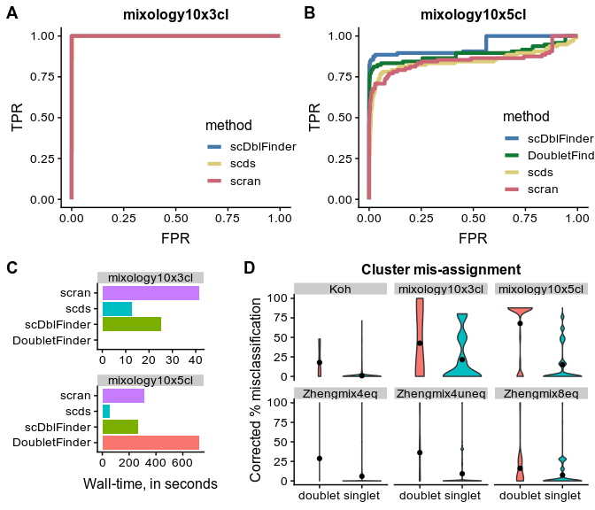

```r
suppressPackageStartupMessages({
  library(SingleCellExperiment)
  library(ROCit)
  library(ggplot2)
  library(cowplot)
})
theme_set(theme_cowplot(font_size = 12))

# we load the dataset
lf <- list.files("../datasets/", pattern="SCE", full.names=TRUE)
names(lf) <- sapply(strsplit(basename(lf),".",fixed=TRUE), head, 1)
CDs <- lapply(lf, FUN=function(x){ as.data.frame(colData(readRDS(x))) })
```


```r
colors <- c("#4477AA", "#117733", "#DDCC77", "#CC6677")
CD <- CDs$mixology10x3cl
truth <- factor(CD$demuxlet_cls, c("SNG","DBL"))
roclist <- lapply( list(scDblFinder=CD$pldf.ratio,
                        scds.hybrid=CD$hybrid_score,
                        scran.score=CD$scran.DblScore),
                   class=truth, FUN=rocit)
d <- data.frame( method=rep( c("scDblFinder","scds","scran"),
                             sapply(roclist, FUN=function(x) length(x$TPR)) ),
                 FPR=unlist(lapply(roclist,FUN=function(x) x$FPR)),
                 TPR=unlist(lapply(roclist,FUN=function(x) x$TPR)) )
p1 <- ggplot(d, aes(FPR, TPR, colour=method)) + geom_line(size=1.5) + ggtitle("mixology10x3cl")
p1 <- p1 + theme(legend.position = c(0.6, 0.3)) + scale_color_manual(values=colors[-2])
  
CD <- CDs$mixology10x5cl
truth <- factor(CD$demuxlet_cls, c("SNG","DBL"))
roclist <- lapply( list(scDblFinder=CD$pldf.ratio,
                        DoubletFinder=CD$doubletFinder.pANN_0.25_0.02_82,
                        scds=CD$hybrid_score,
                        scran=CD$scran.DblScore), 
                   class=truth, FUN=rocit)
d <- data.frame( method=factor( rep(names(roclist), sapply(roclist, FUN=function(x) length(x$TPR))), levels=names(roclist)),
                 FPR=unlist(lapply(roclist,FUN=function(x) x$FPR)),
                 TPR=unlist(lapply(roclist,FUN=function(x) x$TPR)) )
p2 <- ggplot(d, aes(FPR, TPR, colour=method)) + geom_line(size=1.5) + ggtitle("mixology10x5cl")
p2 <- p2 + theme(legend.position = c(0.6, 0.3)) + scale_color_manual(values=colors)
```


```r
rt <- data.frame( time=c(12.83, 41.46, 25.08, NA, 56.15, 310.24, 268.93, 722.031),
                  method=rep(c("scds", "scran", "scDblFinder", "DoubletFinder"),2),
                  dataset=rep(c("mixology10x3cl", "mixology10x5cl"), each=4))
p3 <- ggplot(rt, aes(method, time, fill=method)) + geom_col() + scale_color_manual(values=colors) + facet_wrap(~dataset, scale="free", nrow=2) + coord_flip() + ylab("Wall-time, in seconds") + theme(legend.position="none", axis.title.y=element_blank(), plot.margin=unit(c(1,2,1,1),"lines"))
```


```r
mis <- readRDS("../data/misclassification.rds")
dbl <- lapply(CDs, FUN=function(x) x[,c("pldf.ratio","pldf.class")])
dbl <- dbl[intersect(names(dbl),names(mis))]
for(n in names(dbl)){
  dbl[[n]]$pct_misclassified_cor <- mis[[n]]$corrected_pct_mis[row.names(dbl[[n]])]
  dbl[[n]]$pct_misclassified <- mis[[n]]$pct_misclassified[row.names(dbl[[n]])]
}
d <- as.data.frame(data.table::rbindlist(dbl, idcol="dataset"))
p4 <- ggplot(d, aes(pldf.class, pct_misclassified_cor, fill=pldf.class)) + geom_violin() + facet_wrap(~dataset) + ggtitle("Cluster mis-assignment") + theme(axis.title.x=element_blank(), legend.position="none") + ylab("Corrected % misclassification") + stat_summary(fun.y="mean", geom="point")
```


```r
plot_grid( plot_grid(p1, p2, nrow=1, labels=LETTERS[1:2]), plot_grid(p3, p4, nrow=1, labels=LETTERS[3:4], rel_widths=c(2,3)), nrow=2)
```

```
## Warning: Removed 1 rows containing missing values (position_stack).
```

<!-- -->

**A-B** Receiver operating characteristic (ROC) curves of the tested doublet detection methods for the mixology10x3l (**A**) and mixology10x5cl (**B**) datasets. DoubletFinder failed due to an error on the mixology10x3cl dataset. **C:** Running time of the different methods. **D:** Cell called as doublets by scDblFinder tend to be more often misclassified, i.e. assigned a wrong cluster. The corrected percentage of misclassification is the proportion of times a given cell is misclassified across hundreds of clustering pipelines with various parameters, minus the median misclassification rate of the cell's subpopulation.
