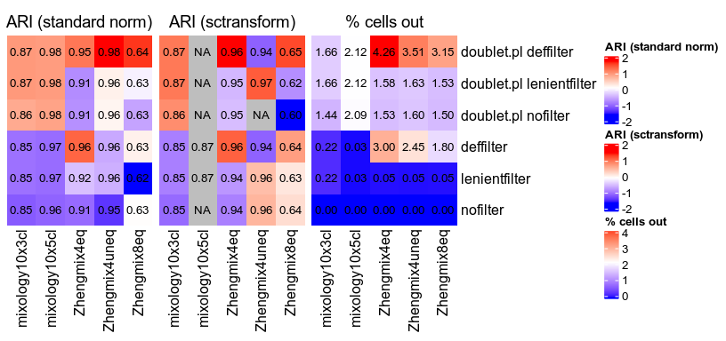

```r
suppressPackageStartupMessages({
  library(ComplexHeatmap)
  library(circlize)
  library(ggplot2)
  library(cowplot)
})
theme_set(theme_cowplot())
suppressMessages(devtools::load_all("../../pipeComp/"))
```

```
## Warning: replacing previous import 'SummarizedExperiment::shift' by
## 'data.table::shift' when loading 'pipeComp'
```

```
## Warning: replacing previous import 'SummarizedExperiment::rowRanges' by
## 'matrixStats::rowRanges' when loading 'pipeComp'
```

```r
source("../misc_functions.R")
data(datasets)
```

```
## Warning in data(datasets): data set 'datasets' not found
```


```r
res <- readRDS("../../flt/summary.rds")
m <- scrna_evalPlot_filtering(res, returnTable=TRUE)
m$doubletRemoval <- !grepl("doubletmethod=none;", m$method)
m$filter <- factor(sapply(strsplit(as.character(m$method),"\\.|="), FUN=function(x) rev(x)[1]),
                     c("nofilter","lenient","default","pca","pca2","stringent"))
cols <- c("black",plgINS::getQualitativePalette(length(levels(m$filter))-1))
```

```
## Setting options('download.file.method.GEOquery'='auto')
```

```
## Setting options('GEOquery.inmemory.gpl'=FALSE)
```

```
## Warning: replacing previous import 'GenomicRanges::shift' by
## 'data.table::shift' when loading 'plgINS'
```

```r
names(cols) <- levels(m$filter)

# ggplot(m, aes(maxPCout, meanF1, group=method, colour=filter, shape=doubletRemoval)) + geom_point(size=3) + facet_wrap(~dataset, scales="free") + scale_color_manual(values=cols) + xlab("Max proportion of subpopulation excluded")

ggplot(m, aes(maxPCout, F1atK, group=method, colour=filter, shape=doubletRemoval)) + geom_point(size=3) + facet_wrap(~dataset, scales="free") + scale_color_manual(values=cols) + xlab("Max proportion of subpopulation excluded") + ylab("mean F1 at true number of clusters")
```

<!-- -->

