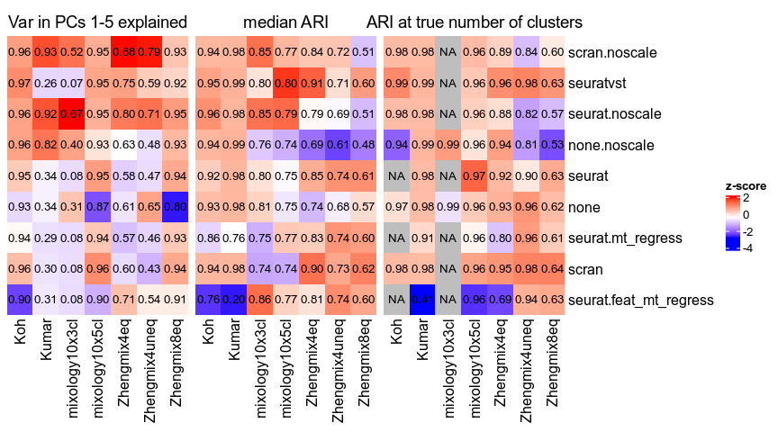

```r
suppressPackageStartupMessages({
  library(ggplot2)
  library(cowplot)
  library(ComplexHeatmap)
})
suppressMessages(devtools::load_all("../../pipComp/"))
data(datasets)
source("../misc_functions.R")
theme_set(theme_cowplot(font_size = 11))
```


```r
res <- readRDS("../../resNew/norm_intermediateSummary.rds")
```


```r
r2 <- res$dimreduction$PC.R2
r2$norm <- gsub("norm.","",reduceMethodNames(r2$method,3),fixed=T)
r2 <- r2[which(r2$dim <= 5),]
r2$R.on.Clusters <- sqrt(r2$value)
r3 <- cast2(r2, formula=norm~dataset, value.var="R.on.Clusters")

res.n <- readRDS("../../resNew/norm_endSummary.rds")
res.n <- res.n[which(res.n$norm != "norm.edgeR"),]
res.n$norm <- relevel(factor(res.n$norm), "norm.seurat")
levels(res.n$norm) <- gsub("norm.","",levels(res.n$norm),fixed=T)

m <- cast2(res.n, formula=norm~dataset, fun.aggregate=median, value.var="ARI")
m2 <- cast2(res.n[which(res.n$nbClusters==datasets[res.n$dataset,"subpopulations"]),], formula=norm~dataset, fun.aggregate=median, value.var="ARI")

ll <- list("Var in PCs 1-5 explained"=r3,
           "median ARI"=m,
           "ARI at true number of clusters"=m2)
chm(ll, scale="column", scaleTitle="z-score", value_format="%.2f", 
            sameScale=T, row_sortFn=function(x){ mean(x,na.rm=T) }, cluster_columns=FALSE)
```

<!-- -->

