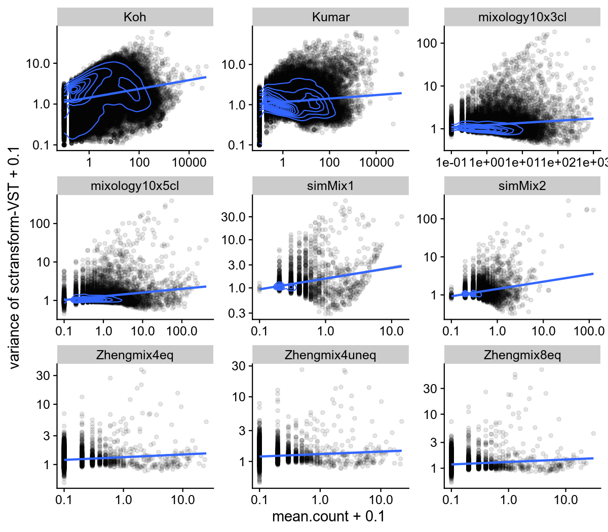

```{r, include=FALSE}
if(!exists('FIG_NB')){
  FIG_NB <- 0
  getFigNb <- function(increment=FALSE){
    if(increment) FIG_NB <<- FIG_NB + 1
    FIG_NB
  }
}
```

```{r}
suppressPackageStartupMessages({
  library(ggplot2)
  library(cowplot)
  library(ComplexHeatmap)
  library(reshape2)
  library(dplyr)
  library(viridis)
  library(pipeComp)
})
theme_set(theme_cowplot(font_size = 11))
source("../misc_functions.R")
```

# Supplementary Figure `r getFigNb(TRUE)`

```{r norm_nbClusters, fig.width=8, fig.height=8.5}
res <- readRDS("../data/norm2_endSummary.rds")
res2 <- res[which(res$filt=="deffilter" & res$norm %in% c("norm.scran", "norm.scran.noscale", "norm.seurat", "norm.seuratvst", "norm.stableGsum")),]
res2$diff.nbClusters <- res2$nbClusters-truek[res2$dataset]
res3 <- aggregate(res2[,"diff.nbClusters"], by=res2[,c("dataset","dims","resolution","norm")], FUN=mean)
colnames(res3)[5] <- "nb"
res3$norm <- gsub("norm.","",res3$norm, fixed=T)
# ggplot(res3, aes(factor(dims), factor(resolution), fill=nb)) + stat_bin2d() + 
#   scale_fill_viridis() + ylab("Resolution") + xlab("Number of dimensions") +
#   theme(axis.text.x = element_text(angle = 90, hjust = 1)) +
#   coord_flip() + facet_grid(dataset~norm)

ll <- lapply(split(res3, res3$dataset), FUN=function(x){
  ggplot(x, aes(factor(resolution), factor(dims), fill=nb)) + stat_bin2d() + 
    scale_fill_viridis() + xlab("Resolution") + ylab("dims") +
    facet_grid(.~norm)
})
for(i in names(ll)){
  ll[[i]] <- ll[[i]] + ggtitle(i)
  if(i==names(ll)[length(ll)]){
    ll[[i]] <- ll[[i]] + theme(axis.text.x = element_text(angle = 90, hjust = 1))
  }else{
    ll[[i]] <- ll[[i]] + theme(axis.title.x=element_blank(), axis.text.x=element_blank(), axis.ticks.x=element_blank())
  }
}
ll[[4]] <- ll[[4]] + ylab("Number of dimensions")

mod <- summary(lm(nbClusters~dataset+norm+dims+resolution, data=res2))
plot_grid(plotlist = ll[-2], nrow=6, rel_heights=c(1,1,1,1,1,1.5))
```

### Supplementary Figure `r getFigNb()`
Mean difference between the number of detected clusters and the number of real subpopulations, depending on the normalization method, the resolution and the number of dimensions used. The Kumar dataset is not shown here due to a lack of variation in the number of clusters detected. A rough ANOVA on `nbClusters~dataset+norm+dims+resolution` suggests that seuratvst (sctransform) is associated with a higher number of clusters (p~`r round(mod$coefficients["normnorm.seuratvst",4],3)`).

\newpage 

# Supplementary Figure `r getFigNb(TRUE)`

```{r VST, echo=FALSE, out.width = '100%'}

```

### Supplementary Figure `r getFigNb()`
Relationship of the variance with mean count after `sctranform`'s variance stabilizing transformation.

\newpage